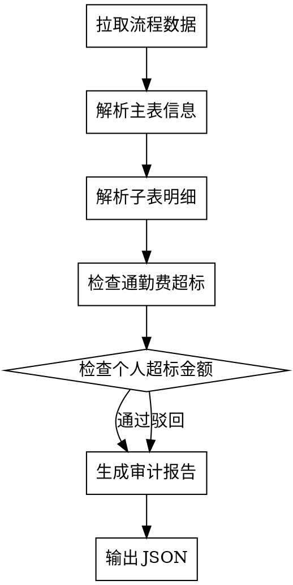

# CW08 流程审计技能

审计因公出差报销申请流程（CW08），检查报销合规性，输出结构化 JSON 审计报告。

## 使用方式

执行脚本时传入流程编号：

```bash
uv run nanobot/skills/audit_cw08/scripts/pull_audit_data.py --request-id <REQUEST_ID>
```

**示例**：
```bash
uv run nanobot/skills/audit_cw08/scripts/pull_audit_data.py --request-id 13217158
```

## 审计流程



## 审计规则

### 主表检查 (`main_table`)
- 表头完整性检查
- 流程编号一致性检查
- 申请日期合理性检查

### 子表检查 (`detail_list[1]` 报销明细)
- **通勤费超标**：字段 `"通勤费超标(正数表示超标)"` ≤ 0 则通过
- **个人超标金额**：基本信息表中 `"出差通勤费"` 超标金额 ≤ 0 则通过
- 其他字段为空则忽略

## 输出格式

**必须输出以下 JSON 结构**：

```json
{
    "request_id": "13217158",
    "flow_id": "CCBX-20260105-015",
    "flow_name": "因公出差报销申请流程",
    "审批结果": "通过",
    "审批理由": "通勤费超标字段值均为负数（-100.10、-228.70），满足不大于0的审批要求",
    "检查详情": {
        "主表检查": {
            "状态": "通过",
            "说明": "表头完整，流程编号一致"
        },
        "通勤费超标检查": {
            "状态": "通过",
            "超标记录": [
                {"序号": "1", "超标值": "-100.10"},
                {"序号": "2", "超标值": "-228.70"}
            ],
            "说明": "所有超标值均为负数，无超标情况"
        },
        "个人超标金额检查": {
            "状态": "通过",
            "出差通勤费超标": "-1213.40",
            "说明": "个人超标金额为负数，无超标情况"
        }
    },
    "审批时间": "2026-04-17T10:00:00"
}
```

**驳回示例**：

```json
{
    "request_id": "13217158",
    "flow_id": "CCBX-20260105-015",
    "flow_name": "因公出差报销申请流程",
    "审批结果": "驳回",
    "审批理由": "报销明细序号2通勤费超标值为+38.50，超过标准限额，需要补充超标说明",
    "检查详情": {
        "主表检查": {
            "状态": "通过",
            "说明": "表头完整"
        },
        "通勤费超标检查": {
            "状态": "驳回",
            "超标记录": [
                {"序号": "1", "超标值": "-100.10", "状态": "通过"},
                {"序号": "2", "超标值": "+38.50", "状态": "驳回"}
            ],
            "说明": "序号2超标值为正数，存在超标情况"
        },
        "个人超标金额检查": {
            "状态": "通过",
            "出差通勤费超标": "-50.00",
            "说明": "无个人超标"
        }
    },
    "审批时间": "2026-04-17T10:00:00"
}
```

## 重要提示

- **最终输出必须是纯 JSON 格式**，不要包含 Markdown 代码块标记
- **审批结果只能是 `"通过"` 或 `"驳回"`**
- **审批时间使用 ISO 8601 格式**：`YYYY-MM-DDTHH:MM:SS`