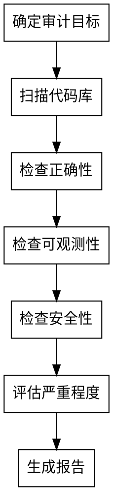

# 流程审计技能

系统性地审计 nanobot 的用户交互流程，重点关注正确性、可观测性和安全性。输出结构化的审计报告，提供可执行的发现和建议。

## 审计范围

| 方面 | 关注点 |
|------|--------|
| **正确性** | 消息流完整性、边界条件处理、错误传播、状态管理 |
| **可观测性** | 日志覆盖、错误追踪、调试能力、指标可见性 |
| **安全性** | 敏感数据处理、SSRF 保护、认证授权、数据泄露风险 |

## 审计流程



## 关键审计文件

```
nanobot/channels/base.py      # 消息处理基类
nanobot/channels/*.py         # 各平台实现
nanobot/agent/loop.py         # AgentLoop 消息分发
nanobot/agent/runner.py       # AgentRunner 执行引擎
nanobot/bus/manager.py        # MessageBus 路由
nanobot/session/manager.py    # 会话状态管理
nanobot/security/network.py   # SSRF 保护
```

## 严重程度评级

| 级别 | 标准 | 示例 |
|------|------|------|
| **严重 (Critical)** | 安全漏洞、数据丢失、服务宕机 | Token 泄露到日志、消息丢失无重试 |
| **高 (High)** | 主要功能损坏、安全弱点 | 缺少 SSRF 检查、吞掉异常 |
| **中 (Medium)** | 用户体验下降、日志不完整 | 缺少错误上下文、状态不一致 |
| **低 (Low)** | 小问题、文档缺失 | 未使用代码、缺少类型注解 |

## 报告格式

```markdown
# 审计报告：[目标模块/流程]

## 概要
- 问题总数：N
- 严重：X，高：Y，中：Z，低：W

## 发现

### [ISSUE-001] [严重程度] 标题
- **位置**：`path/to/file.py:行号`
- **问题**：问题描述
- **影响**：如果不修复会发生什么
- **建议**：具体修复方案

## 正面发现
- 观察到的良好模式
```

## 各方面检查清单

### 正确性
- [ ] 消息流：入站 → 处理 → 出站是否完整？
- [ ] 错误传播：异常是否正确处理或传播？
- [ ] 状态转换：会话/状态更新是否原子且一致？
- [ ] 边界条件：空输入、超时、网络失败是否处理？

### 可观测性
- [ ] 入口/出口点是否有日志？
- [ ] 错误是否包含上下文（不只是"发生错误"）？
- [ ] 状态变化是否可追踪？
- [ ] 调试信息是否足够定位根因？

### 安全性
- [ ] 敏感数据（token、密钥）是否不在日志中？
- [ ] URL 获取前是否验证（SSRF）？
- [ ] 认证失败日志是否不暴露密钥？
- [ ] 状态文件是否正确隔离/保护？

## 常见问题模式

| 模式 | 问题 | 严重程度 |
|------|------|----------|
| `except Exception:` 无日志 | 吞掉错误 | 中-高 |
| `except: pass` | 静默失败 | 高 |
| Token 存文件无加密 | 数据泄露 | 中 |
| URL 获取无 SSRF 检查 | 安全风险 | 高 |
| 失败时返回无错误 | 静默失败 | 中 |
| 日志无上下文 (`logger.error("失败")`) | 可观测性差 | 低 |

## 修复优先级定义

| 优先级 | 标准 | 处理时限 |
|--------|------|----------|
| **P0** | 严重 + 高级别问题 | 立即修复 |
| **P1** | 中级别问题 | 近期修复 |
| **P2** | 低级别问题 | 可延后 |