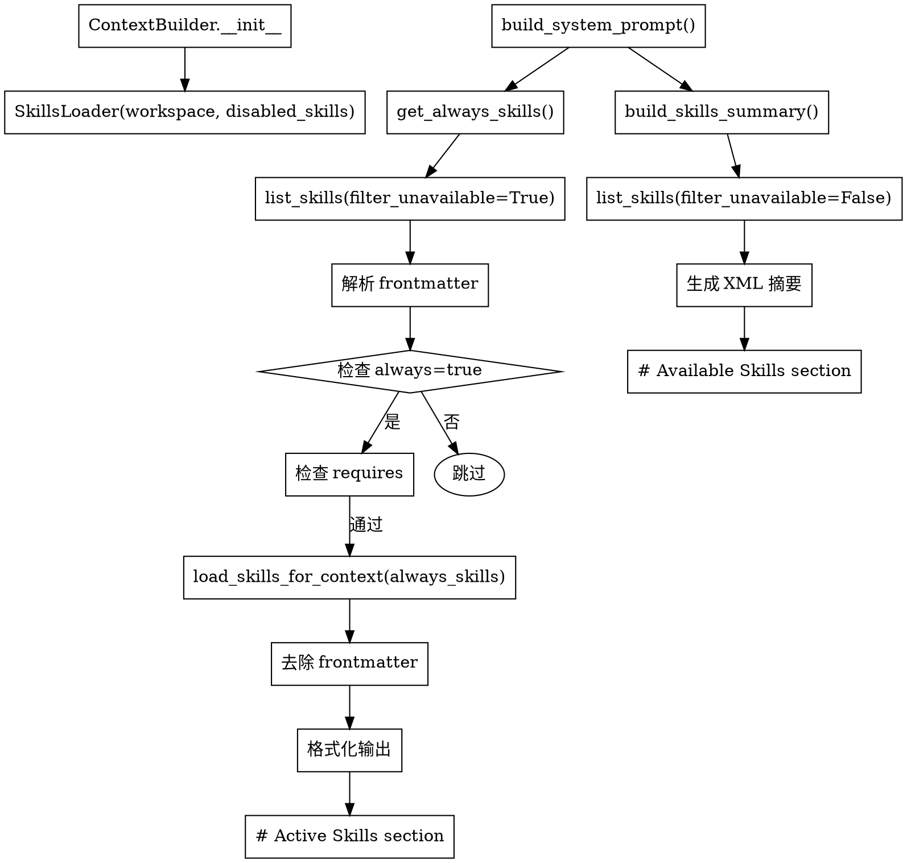

# Skills 加载机制

## 5. context.py: build_messages() [构建上下文]

```python
messages = [
    {"role": "system", "content": build_system_prompt()},  # 系统提示
    *history,                                              # 历史消息
    {"role": "user", "content": merged}                    # 当前消息
]
```

### build_system_prompt() 加载顺序

```
├─ AGENTS.md, SOUL.md, USER.md, TOOLS.md (bootstrap files)
├─ Memory 信息 (MEMORY.md)
├─ Skills 元数据 (always_skills 全量, 其他只摘要)
└─ Recent History (最近对话历史)
```

---

## SkillsLoader 类详解

**位置**: `nanobot/agent/skills.py`

### 初始化参数

```python
class SkillsLoader:
    def __init__(
        self,
        workspace: Path,                           # 工作空间路径
        builtin_skills_dir: Path | None = None,    # 内置 skills 目录
        disabled_skills: set[str] | None = None    # 禁用的 skills 名称集合
    ):
```

### 核心方法

| 方法 | 功能 | 返回值 |
|------|------|--------|
| `list_skills()` | 扫描所有可用 skills | `list[dict]` (name, path, source) |
| `load_skill(name)` | 加载单个 skill 内容 | `str | None` |
| `load_skills_for_context(names)` | 格式化输出 skills（去除 frontmatter） | `str` |
| `build_skills_summary()` | 生成 XML 格式摘要 | `str` |
| `get_always_skills()` | 获取 always=true 的 skills | `list[str]` |
| `get_skill_metadata(name)` | 解析 YAML frontmatter | `dict | None` |

---

## Skills 目录结构

```
nanobot/
├── skills/                          # Builtin Skills (内置)
│   ├── audit_cw08/
│   │   ├── SKILL.md                 # Skill 定义文件
│   │   └── scripts/
│   │       └── pull_audit_data.py   # 辅助脚本
│   └── audit_gyl24/
│       └── SKILL.md
│
workspace/
└── skills/                          # Workspace Skills (用户自定义)
    ├── my_custom_skill/
    │   └── SKILL.md
    └── another_skill/
        └── SKILL.md
```

### 扫描路径优先级

1. **workspace/skills/** - 用户自定义 skills，优先级高
2. **nanobot/skills/** - 内置 skills，workspace 同名 skill 会覆盖 builtin

> 同名 skill 时，workspace 的版本会 shadow（覆盖）builtin 版本

---

## SKILL.md 文件格式

### YAML Frontmatter

```markdown
---
name: audit_cw08
description: "[强制触发] 当用户需要执行 CW08 流程审计时..."
metadata: {"nanobot":{"emoji":"🔍", "always": true}}
---

# Skill 内容
...
```

### Frontmatter 字段

| 字段 | 必填 | 说明 |
|------|------|------|
| `name` | ✅ | Skill 名称（目录名） |
| `description` | ✅ | Skill 描述，用于生成摘要 |
| `metadata` | ❌ | JSON 格式的 nanobot 元数据 |

### metadata JSON 结构

```json
{
  "nanobot": {
    "emoji": "🔍",
    "always": true,
    "requires": {
      "bins": ["python", "uv"],
      "env": ["API_KEY"]
    }
  }
}
```

| metadata 字段 | 说明 |
|---------------|------|
| `always` | `true` 时完整内容加载到 system_prompt |
| `emoji` | 显示图标（可选） |
| `requires.bins` | 依赖的 CLI 工具列表 |
| `requires.env` | 依赖的环境变量列表 |

---

## Skills 加载流程



---

## 具体调用流程 (context.py:31-63)

```python
def build_system_prompt(self, skill_names: list[str] | None = None, channel: str | None = None) -> str:
    parts = [self._get_identity(channel=channel)]

    # 1. Bootstrap files
    bootstrap = self._load_bootstrap_files()
    if bootstrap:
        parts.append(bootstrap)

    # 2. Memory
    memory = self.memory.get_memory_context()
    if memory:
        parts.append(f"# Memory\n\n{memory}")

    # 3. Always Skills - 完整内容加载
    always_skills = self.skills.get_always_skills()           # ['audit_cw08']
    if always_skills:
        always_content = self.skills.load_skills_for_context(always_skills)
        if always_content:
            parts.append(f"# Active Skills\n\n{always_content}")

    # 4. Skills Summary - 元数据摘要
    skills_summary = self.skills.build_skills_summary()
    if skills_summary:
        parts.append(render_template("agent/skills_section.md", skills_summary=skills_summary))

    # 5. Recent History
    entries = self.memory.read_unprocessed_history(...)
    if entries:
        parts.append("# Recent History\n\n" + ...)

    return "\n\n---\n\n".join(parts)
```

---

## 三种加载模式

| 模式 | 加载内容 | 用途 |
|------|----------|------|
| **Always Skills** | 完整内容（去除 frontmatter） | 核心技能，始终加载到 system_prompt |
| **Skills Summary** | XML 格式元数据摘要 | Agent 按需读取完整内容 |
| **按需加载** | Agent 通过 `read_file` 读取 | 避免占用过多 token |

---

## XML 摘要格式

```xml
<skills>
  <skill available="true">
    <name>audit_cw08</name>
    <description>[强制触发] CW08 流程审计...</description>
    <location>/path/to/SKILL.md</location>
  </skill>
  <skill available="false">
    <name>needs_bin</name>
    <description>需要依赖工具</description>
    <location>/path/to/SKILL.md</location>
    <requires>CLI: nanobot_test_fake_binary</requires>
  </skill>
</skills>
```

---

## 依赖检查机制

### 检查逻辑

```python
def _check_requirements(self, skill_meta: dict) -> bool:
    requires = skill_meta.get("requires", {})
    required_bins = requires.get("bins", [])
    required_env_vars = requires.get("env", [])
    # 检查所有 bin 在 PATH 中存在，所有 env 已设置
    return all(shutil.which(cmd) for cmd in required_bins) and \
           all(os.environ.get(var) for var in required_env_vars)
```

### 依赖类型

| 类型 | 检查方法 | 示例 |
|------|----------|------|
| `bins` | `shutil.which(cmd)` | `["python", "uv", "gh"]` |
| `env` | `os.environ.get(var)` | `["API_KEY", "DATABASE_URL"]` |

---

## 禁用 Skills 配置

### 配置文件 (config.yaml)

```yaml
agents:
  defaults:
    disabled_skills:
      - summarize
      - skill-creator
```

### 配置 Schema (schema.py)

```python
class AgentDefaults(Base):
    disabled_skills: list[str] = Field(default_factory=list)
```

### 运行时过滤

```python
# SkillsLoader.__init__
self.disabled_skills = disabled_skills or set()

# list_skills()
if self.disabled_skills:
    skills = [s for s in skills if s["name"] not in self.disabled_skills]
```

---

## 结论

### 元数据处理

- **所有 skills 的元数据都会被解析**（用于生成摘要列表）
- 元数据来自 YAML frontmatter + JSON metadata 字段

### 完整内容加载策略

| Skill 类型 | 加载方式 |
|------------|----------|
| `always=true` 且依赖满足 | 完整内容加载到 system_prompt |
| 其他 skills | 只显示摘要，agent 通过 `read_file` 按需加载 |
| 依赖不满足 | 标记 `available="false"`，不加载 |

### Token 优化设计

这种设计是为了控制 token 使用量：
- 只把**必须的 skill 内容**放入 system_prompt
- 其他 skill 让 agent **按需加载**，避免一次性加载过多内容
- 依赖检查避免加载不可用的 skills

### 关键文件

| 文件 | 职责 |
|------|------|
| `nanobot/agent/skills.py` | SkillsLoader 类实现 |
| `nanobot/agent/context.py` | ContextBuilder 调用 skills 加载 |
| `nanobot/config/schema.py` | disabled_skills 配置 |
| `nanobot/skills/*/SKILL.md` | 内置 skills 定义 |
| `workspace/skills/*/SKILL.md` | 用户自定义 skills |